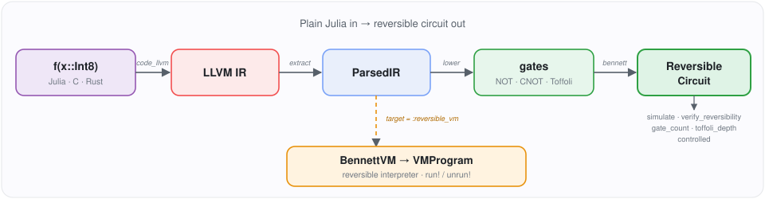

```@meta
CurrentModule = Bennett
```

# Bennett.jl

*Compile any pure Julia function into a classical reversible circuit — NOT, CNOT,
Toffoli — with every ancilla provably returned to zero.*

A classical computation throws information away, and that forgetting is what makes it
irreversible. [Bennett's 1973 construction](https://doi.org/10.1147/rd.176.0525) buys the
information back: run the computation, copy out the answer, then run it backwards to erase
every intermediate. Bennett.jl does this automatically, at the **LLVM IR level**, for
plain Julia functions on plain integers (and `Float64` via branchless soft-float) — no
special types, no operator overloading, no annotations.

```julia
using Bennett

f(x::Int8) = x*x + Int8(3)*x + Int8(1)

c = reversible_compile(f, Int8)
simulate(c, Int8(5))        # => 41
verify_reversibility(c)     # => true
gate_count(c)               # => (total = 482, NOT = 14, CNOT = 300, Toffoli = 168)
```



## Two backends, one front door

A reversible **circuit** is a fixed permutation — perfect for a quantum oracle, but with
no program counter and no runtime-sized memory. For computations whose length the input
decides, Bennett.jl has a second lowering target — **[BennettVM](https://github.com/tobiasosborne/BennettVM.jl)**,
a reversible abstract machine — selected by one keyword:

```julia
reversible_compile(f, Int64)                                      # → ReversibleCircuit (default)
using BennettVM
reversible_compile(collatz_steps, Int64; target = :reversible_vm) # → BennettVM.VMProgram
```

Both targets share the same LLVM-IR frontend. The reversible-VM target is shipped:
end-to-end Collatz round-trips through the VM today.

## Documentation map

This site follows the [Diátaxis](https://diataxis.fr) structure.

**Learn** — start here.
- [Installation](getting_started/install.md)
- [Quick start](getting_started/quickstart.md)
- [Your first circuit](tutorials/first_circuit.md)
- [Control flow & loops](tutorials/control_flow_and_loops.md)
- [Floats & transcendentals](tutorials/floats.md)

**Do** — task recipes.
- [Choose an arithmetic strategy](howto/arithmetic_strategy.md)
- [Reversible memory](howto/reversible_memory.md)
- [Compile C / Rust](howto/other_languages.md)
- [Target the reversible VM](howto/reversible_vm.md)
- [Quantum control](howto/quantum_control.md)

**Understand** — the design.
- [Architecture](explanation/architecture.md)
- [Bennett's construction](explanation/bennett_construction.md)
- [Why branchless soft-float](explanation/branchless_softfloat.md)
- [Architectural limits](explanation/architectural_limits.md)

**Look up** — reference.
- [API reference](reference/api.md)
- [Strategies](reference/strategies.md)
- [Bibliography](reference/bibliography.md)

## Building these docs

```bash
cd docs
julia --project -e 'using Pkg; Pkg.develop(path=".."); Pkg.instantiate()'
julia --project make.jl
```

Per `CLAUDE.md` §14 there is no GitHub Actions CI; the `jldoctest` fences are executed by
the local `make.jl` build, which fails on doctest drift with the expected/actual diff
inline. Source: <https://github.com/tobiasosborne/Bennett.jl>.
