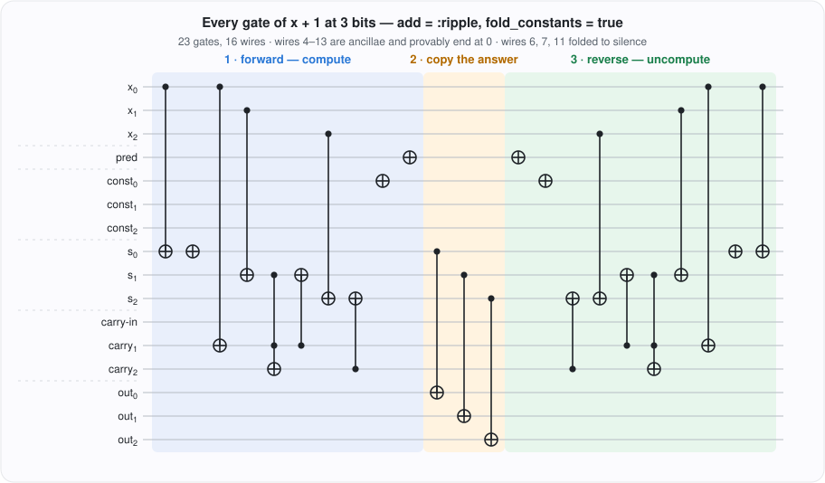

# Reading the gates

*What a compiled circuit actually says: the three gate types, the wire map,
and how to spot Bennett's forward–copy–reverse sandwich in a real gate
listing.*

[Your first circuit](first_circuit.md) compiled `x + Int8(1)` and read off its
cost metrics without ever looking inside. This tutorial looks inside. The
58-gate 8-bit circuit is too long to study line by line, so we compile the
same function at **3 bits** — small enough that the whole gate list fits on
one screen and every wire can be named — and read the entire thing. By the
end, a line like `ToffoliGate(9, 12, 13)` will read as a sentence.

Every block below is a real REPL transcript with the real output.

## A circuit small enough to read whole

The `bit_width` keyword narrows the compiled IR to `W` bits (the argument
type still sets the *Julia-side* semantics; the circuit computes modulo
`2^W`). Three bits of `x + 1`:

```jldoctest reading_gates
julia> using Bennett

julia> c = reversible_compile(x -> x + UInt8(1), UInt8;
                              bit_width = 3, add = :ripple, fold_constants = true)
ReversibleCircuit:
  Wires:     16
  Input:     3 wires [3]
  Output:    3 wires
  Ancillae:  10
  Gates:     23 (NOT=6, CNOT=15, Toffoli=2)
  Depth:     9
  Peak live: 4
```

Read the summary as a budget. Sixteen wires partition into three disjoint
sets — `3` input, `3` output, `10` ancillae — and the partition is a
structural invariant of `ReversibleCircuit` (the constructor rejects any
overlap). The three sets are plain fields:

```jldoctest reading_gates
julia> c.input_wires
3-element Vector{Int64}:
 1
 2
 3

julia> c.output_wires
3-element Vector{Int64}:
 14
 15
 16
```

`c.ancilla_wires` is everything in between, `4:13`. Wire 1 is the **least
significant bit** of `x` — Bennett.jl's wire order is LSB-first throughout.

It still computes `x + 1`, now modulo `2^3`. (`simulate` returns the raw
output register as an unsigned machine word under `bit_width` narrowing;
wrap it in `Int` for display.)

```jldoctest reading_gates
julia> Int(simulate(c, UInt8(3)))
4

julia> all(simulate(c, UInt8(x)) == UInt8((x + 1) % 8) for x in 0:7)
true
```

Eight inputs, all checked — the exhaustive-verification house style, at
toy scale.

## The three gate types

Everything Bennett.jl emits is one of three primitives, and each is a
one-line sentence about wires:

| Gate | Reads as | Semantics |
|---|---|---|
| `NOTGate(t)` | "flip `t`" | `t ⊻= 1` |
| `CNOTGate(c, t)` | "if `c`, flip `t`" | `t ⊻= c` |
| `ToffoliGate(a, b, t)` | "if `a` **and** `b`, flip `t`" | `t ⊻= a & b` |

Two facts do all the work in what follows. First, each gate **only ever
XORs its target** — controls are never modified, so information is never
erased. Second, each gate is **its own inverse**: apply it twice and the
target is back where it started. That self-inverse property is what makes
"run the gate list backwards" meaningful.

Toffoli is the expensive one — it is the only gate that computes an AND,
it is universal for classical reversible logic, and on fault-tolerant
quantum hardware it decomposes to 7 T-gates while NOT and CNOT are nearly
free. That is why `gate_count` itemizes it and why `toffoli_depth` exists.

## The wire map

Here is the whole circuit, drawn in standard notation (`●` control,
`⊕` XOR target), with the wires labeled by role:



Where those roles come from:

- **Wires 1–3** — the argument `x`, LSB first.
- **Wire 4** — the entry basic block's *path-predicate* wire, set to 1
  (this function has no branches, so nothing ever consults it).
- **Wires 5–7** — the folded constant `1`, one wire per bit; only wire 5
  (the LSB) is ever set.
- **Wires 8–10** — the sum bits, the ripple adder's result.
- **Wires 11–13** — the carry chain; wire 11 is the carry-in.
- **Wires 14–16** — the output register, allocated by the Bennett wrap.

Notice wires 6, 7, and 11 have *no gates at all*. They are the compiler's
constant-folding at work: every gate that read them had a control known to
be `0` (the high bits of the constant `1`, the zero carry-in) and folded
away to nothing. The wires were allocated, then the gates on them
evaporated. An `ifelse(false, _, x)` costs zero gates for the same reason —
a fact that decides which data structures compile well (see the
persistent-DS finding in the [README](../../../README.md)).

## The listing, phase by phase

A `ReversibleCircuit` is iterable and indexable, so collect it and look:

```jldoctest reading_gates
julia> gs = collect(c);

julia> gs
23-element Vector{ReversibleGate}:
 CNOTGate(1, 8)
 NOTGate(8)
 CNOTGate(1, 12)
 CNOTGate(2, 9)
 ToffoliGate(9, 12, 13)
 CNOTGate(12, 9)
 CNOTGate(3, 10)
 CNOTGate(13, 10)
 NOTGate(5)
 NOTGate(4)
 CNOTGate(8, 14)
 CNOTGate(9, 15)
 CNOTGate(10, 16)
 NOTGate(4)
 NOTGate(5)
 CNOTGate(13, 10)
 CNOTGate(3, 10)
 CNOTGate(12, 9)
 ToffoliGate(9, 12, 13)
 CNOTGate(2, 9)
 CNOTGate(1, 12)
 NOTGate(8)
 CNOTGate(1, 8)
```

**Gates 1–10, forward.** With the wire map in hand, the arithmetic reads
off directly. Gates 1–2: `s₀ = x₀ ⊻ 1` — copy the input bit onto sum wire
8, then flip it, because adding 1 always toggles the LSB (the CNOT from
constant wire 5 folded into that bare `NOTGate(8)`). Gates 3–6 build bit 1:
copy `x₀` onto carry wire 12 (adding 1 carries exactly when `x₀ = 1`) and
`x₁` onto sum wire 9, then `ToffoliGate(9, 12, 13)` — "if `x₁` and carry₁,
flip carry₂" — computes the next carry *before* gate 6 finishes
`s₁ = x₁ ⊻ carry₁`. Gates 7–8 are
bit 2: `s₂ = x₂ ⊻ carry₂`, no further carry — the overflow off the top is
discarded, which is exactly mod-`2^3` arithmetic. Gates 9–10 materialize
the two leftover known-true constants (wires 5 and 4) at the end of the
folded forward pass.

**Gates 11–13, copy-out.** The Bennett wrap CNOTs each sum bit onto a
fresh output wire:

```jldoctest reading_gates
julia> gs[11:13]
3-element Vector{ReversibleGate}:
 CNOTGate(8, 14)
 CNOTGate(9, 15)
 CNOTGate(10, 16)
```

**Gates 14–23, reverse.** The forward pass, replayed backwards — and
because every gate is self-inverse, this is not a metaphor but an exact
mirror:

```jldoctest reading_gates
julia> gs[14:23] == reverse(gs[1:10])
true
```

The reverse pass drives every ancilla — sums, carries, constants,
predicate — back to `0`. The copies on wires 14–16 survive because no
reverse-pass gate touches them. Net effect: `(x, 0…0) ↦ (x, x+1)`.

That `2 × 10 + 3 = 23` shape is the general law: a Bennett-wrapped circuit
costs twice its forward gates plus one CNOT per output bit. When you see a
gate listing whose second half mirrors its first, you are looking at
Bennett's construction; the copy sandwich in the middle tells you where
the answer lives.

## Watch it run

The same circuit, animated for `x = 3`: the thick trail marks wires
holding `1`, the cursor is the current gate. Watch the carries rise in the
forward pass, the answer land on the output register at the copy, and
every ancilla go dark by the end.



What the animation shows is precisely what `verify_reversibility` asserts
on random inputs — ancillae zero, inputs preserved, reverse-of-reverse
identity:

```jldoctest reading_gates
julia> verify_reversibility(c)
true
```

## Reading the metrics off the listing

Every number from the summary block is now visible in the listing itself:

- **Gates: 23** — ten forward, three copy, ten reverse.
- **Toffoli = 2** — one carry computation, forward and mirrored. The
  8-bit version has 12: the carry chain is the Toffoli backbone of every
  ripple adder, which is why `x + Int8(1)` has `toffoli_depth == 12` —
  the carries serialize.
- **Depth: 9** — the longest *data-dependence* chain, not the gate count:
  independent gates (different bits' CNOTs) count as parallel layers.
- **Peak live: 4** — at most four wires hold a `1` simultaneously during
  the all-zero-input run that `peak_live_wires` measures; the animation
  shows the live set never getting wide. Space-saving strategies (`PebbledStrategy`, `EagerStrategy`)
  attack exactly this number.

## Where to go next

- [Bennett's construction](../explanation/bennett_construction.md) — the
  *why* behind the sandwich, the 1973 theorem, and the space–time
  trade-off literature (pebbling, EAGER) for when forward+copy+reverse
  is too expensive.
- The doubling law this circuit obeys at every width
  (`total(2W) = 2·total(W) − 2`, pinned in
  `test/test_gate_count_regression.jl`) is plotted in the README's
  benchmarks section.
- [Choose an arithmetic strategy](../howto/arithmetic_strategy.md) — what
  changes in the listing when `add = :cuccaro` (in-place, one ancilla) or
  `:qcla` (carry-lookahead, `O(log W)` Toffoli-depth) replaces the ripple
  adder.
